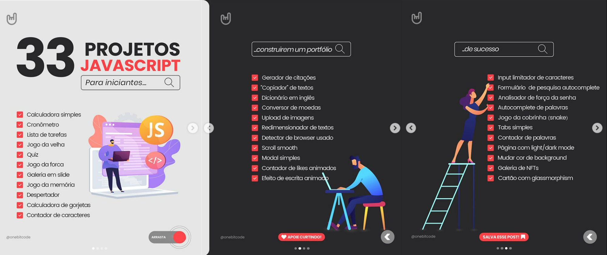

<h1 align="center"> Projetos - Iniciando na Programação Web </h1>

Ideia retirada do instagram da <a href="https://www.instagram.com/onebitcode/">OneBitCode</a>, para conhecer e praticar tecnologias WEB.  

 

<!-- pasta para o git conseguir acessar a foto -->

  

## 🚀 Tecnologias

Projetos desenvolvidos com as seguintes tecnologias:

- HTML e CSS
- JavaScript
- Git e Github

## 💻 Desafios

- [Calculadora Simples](https://cibellemc.github.io/projetos-web/calculadora/)
